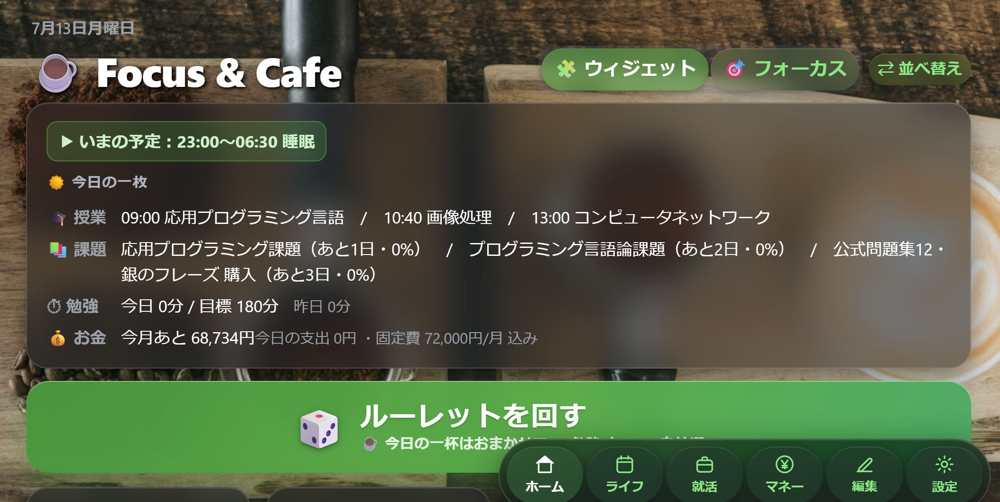
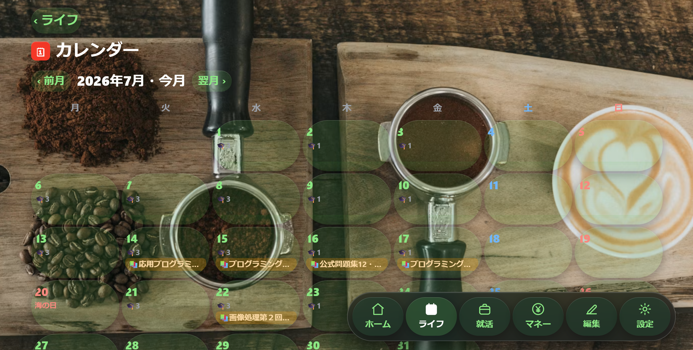
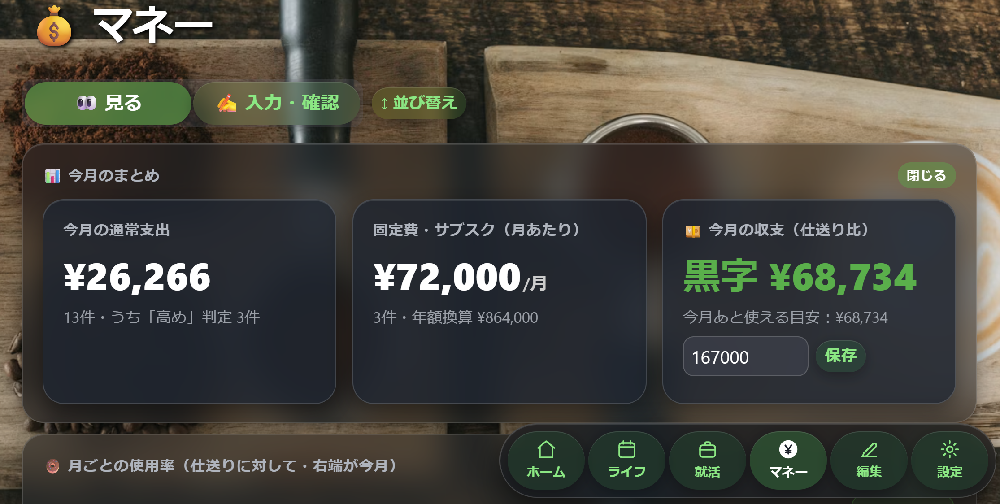
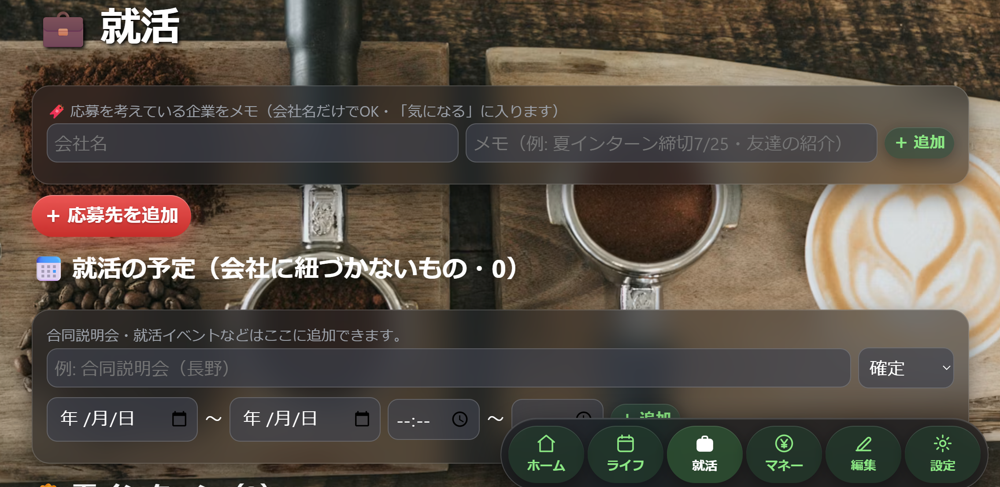

# ☕ Focus & Cafe — 大学生活オールインワン管理アプリ

**勉強・生活・金銭・就活を1つに統合した、実運用中の個人開発アプリ。**
React + FastAPI + SQLite の3層構成に、Google Apps Script / iPhoneショートカット / PySide6常駐ツールを組み合わせ、
「PCでもスマホでも、入力も確認もできる生活基盤」を1人で設計・開発・運用しています。


| ホーム | ライフ（カレンダー） | マネー | 就活 |
|---|---|---|---|
|  |  |  |  |

---

## なにを解決するアプリか

大学生の「今日やること」は、授業・課題・バイト・勉強・家計・就活・私生活と複数のツールに散らばりがちです。
本アプリはそれらを **1つのローカルアプリ＋Googleカレンダー連携** に集約し、

- **朝アプリを開けば今日の全部がわかる**（☀️今日の一枚：授業・締切・就活日程・予算残高）
- **勉強はルーレットとゲーム解放でゲーミフィケーション**
- **支出はカード利用通知メールから自動記録**（手入力ほぼゼロ）
- **外出先はiPhoneから入力・確認**（サーバー代ゼロで実現）

を実運用しています。

## ✨ 主な機能

### 🏠 ホーム（時間管理のコア）
- **カフェルーレット**：勉強/気分転換のお題を抽選。「今日絶対やる」優先・重点3倍・連続気分転換の禁止などの独自ルール
- **集中モード**：規定時間を達成するまで終了できないストイック仕様。タイマーは絶対時刻基準で**リロード・再起動しても継続**。ブラウザ通知＋タブタイトルに残り時間
- **ゲーム解放**：目標達成×時間帯（20時〜翌3時）でのみゲーム解禁。未達成時は常駐ワーカーが**ゲームの起動そのものをブロック**
- **☀️ 今日の一枚**：今日の授業・期限3日以内の課題・就活日程（被り警告つき）・勉強進捗・今月の残り予算を1枚に集約。いまの時間帯の予定もリアルタイム表示
- **iPhone風UI（リキッドグラス）**：ウィジェット式ホーム（ドラッグ並べ替え）、四辺に移動できるタブバー、アクションシート。従来UIにもワンタップで戻せる

### 📅 ライフ（生活の記録と予定）
- 曜日別**時間割**（教室メモつき）・単発予定・実績の記録、横スクロールの**1日タイムライン**（予定/実績/PC使用の3レーン）
- **課題管理（Notion風）**：期限・進捗%・メモ・種類（🎓大学/🏠私生活/💼就活）。**毎週の課題テンプレート**から週次インスタンスを自動生成し、期限2日以内は「今日絶対やる」へ自動昇格
- **月カレンダー**：祝日（jpholiday）・日付単位の曜日振替・休講・課題・就活日程を1画面に。日付を選ぶとその日の中身が時刻順一覧で見える
- **PCスクリーンタイム自動記録**：常駐トラッカーが最前面アプリを記録しタイムラインに表示
- 日次サマリー（前日比コメント・ルールアラート）／週次レポート

### 💰 マネー（家計の自動化）
- **カード利用通知メールの自動取り込み**（Gmail IMAP・UID増分＋過去分バックフィル）
- **銀行/カードCSVの一括取り込み**と**Amazon公式注文履歴による商品名・カテゴリ自動付与**（注文合計→発送グループ→組み合わせの多段マッチング）
- **4段構えの重複排除**：完全一致キー／メール由来±2日同額／再取込ガード／返金の自動相殺 — 何度取り込んでも二重計上されない
- 支出の妥当性判定（過去比較の簡易判定＋任意でClaude APIによるAI判定・月次レビュー）
- 月別予算ドーナツ・カテゴリ内訳・固定費/サブスク管理（月割り配分・満足度トラッキング）・欲しい物リスト
- 画面は「👀見る（ダッシュボード）/✍️入力・確認」の2モード。セクションは開閉式で並び替えも保存

### 💼 就活
- 応募先カード（選考状況の色付きステージ・優先度・提出したES・メモ）、気になる企業のワンライン追加
- 日程管理：会社に紐づかない予定（合同説明会）・**候補日の第N希望**にも対応
- **日程被り検知**：期間が重なる予定を検出し、優先度順に並べて警告（同一会社の候補日同士は除外）

### ☁️ Google連携・📱iPhone連携（サーバー代ゼロ）
自分のGoogleアカウントにデプロイした **Apps Script をブリッジ**にして：
- 授業（1日1件の「○曜日課」まとめ or コマごと・選択制）・予定・課題期限・**📋課題ボード**（全課題の進捗一覧）・就活日程を**Googleカレンダーへ自動同期** → スマホで確認
- iPhoneショートカットから **勉強タイマー／支出／予定（複数日対応）／課題メモ・進捗更新** を送信 → Drive上の受信箱をPCが5分おきに取り込み
- 同期は説明欄の `fcid:` タグ付きイベントだけを入れ替えるため**手動の予定を壊さない**

### 🖥 デスクトップ常駐ツール（PySide6）
- **クイックスタート小窓**：常時最前面のミニタイマー。テーマ3種×形3種（カード/丸/**ねこラテのマグカップ**）。
  カップには**温度システム**があり、勉強しないと3時間かけて湯気が消え、勉強中は電子ヒーターが現れて温め直せる。計測中は丸いミニ表示に縮小可能
- **ゲームブロッカー**・**PC使用トラッカー**（コンソールなしのバックグラウンド動作）

### 🔁 2台のPCで共有
- 使用中は5分おきにDBをGoogleドライブへ自動プッシュ、もう一方のPCは起動時に確認つきで取り込み
- ノートPCは**Gドライブ上のバッチ1つ**で最新コードの取得〜初回セットアップ〜起動まで完了

## 🏗 技術構成と選定理由

| 層 | 技術 | 選定理由 |
|---|---|---|
| フロントエンド | React 19 + Vite 6 | Streamlitでは難しいアニメーション・レイアウト制御のため。状態管理は標準hooksのみ |
| バックエンド | FastAPI + SQLAlchemy 2.0 | 既存のPythonロジックを移植しやすく、自動ドキュメント（/docs）付き。機能ごとにAPIRouterで分割 |
| データベース | SQLite | ファイル1個で完結し、個人用途＋Gドライブ同期と相性が良い。接続層分離済みでPostgreSQLへ移行可能 |
| クラウド連携 | Google Apps Script | 無料・サーバーレスでGoogleカレンダー/Driveへの書き込みを仲介。合言葉トークンで保護 |
| デスクトップ | PySide6 / psutil | OS操作（常駐小窓・プロセス監視・画面記録）はPythonワーカーに分離し、REST/SQLite経由で連携 |
| テスト | pytest | 時刻境界・日付またぎ・抽選ルールなど25テスト |

```
                         ┌─ iPhone（ショートカット4種：タイマー/支出/予定/課題メモ）
                         ▼
      Google カレンダー ⇄ Apps Script ブリッジ ⇄ Drive(受信箱 phone_inbox.json)
                                ▲                       │ 5分おきに取込
   ┌────────────┐  HTTP(REST)  ┌┴───────────────┐      ▼        ┌──────────────┐
   │ React(Vite) │ ⇄ ───────── │ FastAPI         │ ⇄ ────────── │ SQLite        │
   │ :5173       │             │ :8000           │              │ focus_cafe.db │
   └────────────┘             └─────────────────┘              └───┬──────────┘
        ▲      POST /api/logs        ▲     ▲                        │ 自動プッシュ(5分)
   ┌────┴─────────┐  ┌──────────────┴┐  ┌─┴────────────┐          ▼
   │ quick_widget  │  │ pc_tracker    │  │ blocker      │   Google ドライブ ⇄ ノートPC
   │ (ねこラテ小窓) │  │ (画面時間記録) │  │ (ゲーム監視)  │
   └──────────────┘  └───────────────┘  └──────────────┘
```

## 📂 フォルダ構成

```
├── frontend/src/
│   ├── views/           # 従来UI（Dashboard / Active / Review / Sos / EditPanel）
│   ├── ios/             # iPhone風UI（シェル・ホーム・ライフ・就活・カレンダー・タイムライン）
│   ├── money/           # マネータブ（UI・集計ロジック・CSV/Amazon解析）
│   └── api.js           # API呼び出しの集約
├── backend/
│   ├── app/
│   │   ├── main.py      # コアAPI（設定/状態/履歴/ルーレット/集中フロー）＋起動時初期化
│   │   ├── life_api.py  # ライフ（時間割/予定/課題/カレンダー/祝日振替/集計/ブリーフィング）
│   │   ├── money_api.py # マネー（記録/判定/一括取込/バックアップ/AIプロキシ）
│   │   ├── mail_import.py  # Gmail IMAPでカード利用通知を自動取込
│   │   ├── gcal_sync.py    # Googleカレンダー同期＋iPhone受信箱の取込
│   │   ├── jobs_api.py     # 就活（応募先/日程/被り検知）
│   │   ├── db_sync.py      # PC間共有（DBの自動プッシュ）
│   │   └── logic.py / models.py / crud.py / migrate.py / database.py
│   ├── tests/           # pytest（25テスト）
│   └── data/            # SQLite本体（git管理外・個人データ）
├── gas/gas_bridge.gs    # Apps Scriptブリッジ（各自のアカウントにデプロイして使う）
├── docs/SETUP_GOOGLE_SYNC.md  # Google連携・iPhoneショートカットの手順書
├── quick_widget.py / blocker.py / pc_tracker.py   # 常駐ツール
├── import_card_csv.py / import_amazon_orders.py   # 明細CSV・Amazon履歴の取込ツール
├── setup.bat / start_all.bat / run_tests.bat / laptop_start.bat
└── SPEC.md              # 全機能の仕様書（AIに渡せる再現プロンプト形式）
```

## 🚀 セットアップと起動（Windows）

前提：Python 3.12+ / Node.js LTS

1. 初回のみ：`setup.bat`（npm install・venv作成・pip install）
2. 起動：`start_all.bat`（バックエンド・フロント・常駐ツールが起動しブラウザが開く）
3. 停止：タスクバーの2つのコンソールを閉じる

- APIドキュメント：http://127.0.0.1:8000/docs
- Googleカレンダー・iPhone連携：[docs/SETUP_GOOGLE_SYNC.md](docs/SETUP_GOOGLE_SYNC.md)（約10分・無料）
- 2台目のPC：Googleドライブの保管フォルダにある `laptop_start.bat` を実行するだけ

## 🧪 テスト

```
run_tests.bat   （= backend/venv の pytest -v）
```

境界値を含む25テスト：ゲーム解放の時間帯（19:59✕/20:00○/2:59○/3:00✕）、
日付またぎで「目標・合計だけリセットし実行中タスクは保持」する挙動、
抽選ルール（mustdo優先/重点3倍/連続気分転換の禁止）、旧データ移行など。

## 🔒 セキュリティ・プライバシー設計

- **秘密情報はローカルSQLiteのみに保存**：GmailアプリパスワードとAnthropic APIキーはDB内にだけ持ち、
  リポジトリには一切含めない（`backend/data/` はgitignore）
- Apps Scriptブリッジは**合言葉トークン**の一致しないリクエストを全拒否。リポジトリ上はプレースホルダ（CHANGE_ME）
- メール本文・CSV・商品名など**外部由来のテキストは常にデータとして扱い**、長さ制限・形式検証をかけて取り込む
- 破壊的な取り込み処理には必ず**取り消し手段**（Amazon突き合わせの一括リセット等）か確認ダイアログを用意

## 💡 設計上のポイント

- **タイマーは絶対時刻基準**：経過カウントではなく開始Unix秒から毎回計算 → リロード・再起動に強い
- **「実効曜日」の一元化**：手動振替 → 祝日（土曜扱い）→ 実曜日の優先順で解決する関数を
  タイムライン・カレンダー・Google同期のすべてが共有 → 祝日や振替授業でも全機能の表示が一致
- **金銭データの重複排除を多層防御に**：取り込み経路が3つ（メール/CSV/手入力）あるため、
  正規化キー完全一致（件数カウント式）＋±2日同額ヒューリスティック＋ソース別ガード＋返金相殺で
  「いつ何度実行しても安全」を実現。一括判定はカテゴリ集計キャッシュでO(N²)→O(N)に改善
- **クラウド同期はタグ方式**：カレンダーは `fcid:` タグ付きイベントのみ入れ替え、
  受信箱はタイムスタンプ増分取込 → 手動データを壊さず、再実行も安全
- **OS連携はプロセス分離**：ブロッカーはDBを読み取り専用で監視する独立ワーカー（本体停止中も動作）
- **遊び心もUXの一部**：小窓のマグカップは「勉強しないと3時間で湯気が消え、勉強中はヒーターで温め直る」
  温度パラメータを持ち、再起動しても引き継がれる

## 📜 開発の歩み

1. **v1（Python + Streamlit）**：勉強ルーレットの原型。JSON/CSV保存
2. **v2（本リポジトリ）**：React + FastAPI + SQLiteへ全面リプレース。旧データは初回起動時に自動移行
3. その後、実際に毎日使いながら **ライフ → マネー → Google/iPhone連携 → 就活 → 2台同期** と拡張。
   カード明細の重複排除やAmazonマッチングは、実データで失敗→原因分析→再設計を繰り返して現在の形に

## License

個人プロジェクトです。コードの閲覧・参考は自由にどうぞ（Issue/PRは受け付けていません）。
